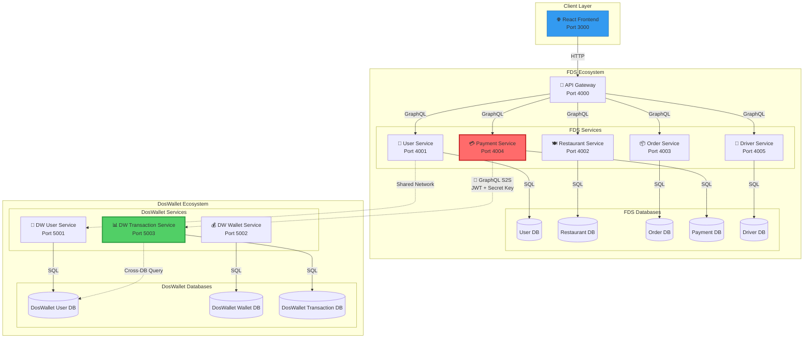
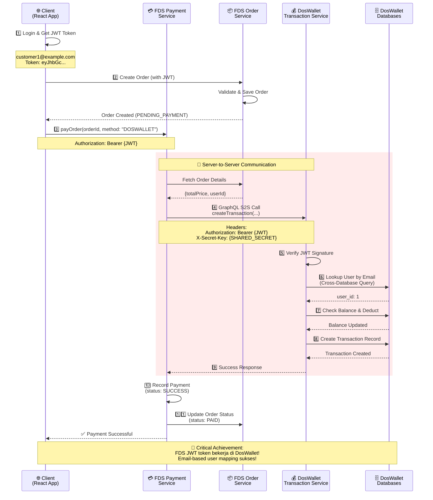

# 🚀 UASIAE - Integrated Food Delivery System & DosWallet Payment

**Sistem Ekosistem Berbasis Microservices yang mengintegrasikan Merchant System (FDS) dan Payment Provider (DosWallet) menggunakan GraphQL Server-to-Server Communication, Docker Containerization, dan Strict JWT Authentication.**

---

## 👥 Kelompok Mataram Is Red

| NIM | Nama | Role |
|-----|------|------|
| 102022330145 | Muhammad Rayhan Ramadhan | Backend Developer & DevOps |
| 102022300082 | Darvesh Gladwin Musyaffa | Full-Stack Developer |
| 102022300416 | Jehezkiel Agna Saputra | Frontend Developer & Integration |

---

## 🏗️ System Architecture

### 📊 Container Topology



### 🔄 Payment Integration Flow (Server-to-Server)



---

## ✨ Key Features

### 🔧 Technical Achievements

#### 1️⃣ **Microservices Architecture**
- **8+ Container** berjalan simultan (5 FDS Services + 3 DosWallet Services)
- Service isolation dengan dedicated databases
- Scalable & maintainable architecture

#### 2️⃣ **Full GraphQL Migration**
- **Strawberry Python** implementation untuk FDS Services
- **Graphene Python** untuk DosWallet Services
- Type-safe queries & mutations
- GraphiQL playground untuk testing

#### 3️⃣ **Strict Security Implementation**
- `@isAuthenticated` decorators di semua resolver
- JWT token validation pada setiap request
- Error codes: `UNAUTHENTICATED`, `FORBIDDEN`, `NOT_FOUND`
- Cross-system authentication (FDS ↔ DosWallet)

#### 4️⃣ **Cross-System Interoperability**
- **GraphQL Server-to-Server (S2S)** communication
- Real-time balance fetching dari DosWallet
- Email-based user mapping (FDS user_id ≠ DosWallet user_id)
- Cross-database queries dengan proper MySQL permissions

#### 5️⃣ **Production-Ready Features**
- Docker Compose orchestration
- Environment-based configuration
- Database seeding & migration scripts
- Comprehensive error handling

---

## 📥 Installation & Run Guide

### Prerequisites
- Docker & Docker Compose
- Python 3.9+
- Node.js 16+ (untuk frontend)

### 🚀 Quick Start (Full System)

#### 1️⃣ Clone Repository
```bash
cd /Users/rayyyhann/Documents/UASIAE
```

#### 2️⃣ Create Shared Network
```bash
docker network create shared-network
```

#### 3️⃣ Start FDS System
```bash
cd UASIAE-FoodDeliverySystem-withIntegration
docker-compose up --build -d
```

#### 4️⃣ Start DosWallet System
```bash
cd ../DOSWALLET-WEB
docker-compose up --build -d
```

#### 5️⃣ Seed Database (Optional - Jika Belum Ada Data)
```bash
# FDS Database Seeding
cd UASIAE-FoodDeliverySystem-withIntegration
docker-compose exec user-service python seed.py

# DosWallet Database Seeding
cd ../DOSWALLET-WEB/database
docker-compose exec dw-user-service python seed_users.py
```

#### 6️⃣ Access Applications
- **Frontend:** http://localhost:3000
- **Admin Panel:** http://localhost:3000/admin
- **FDS API Gateway:** http://localhost:4000
- **DosWallet User Service:** http://localhost:5001/graphql

### 🔄 Reset Database (Hard Reset)
```bash
cd UASIAE-FoodDeliverySystem-withIntegration
docker-compose exec order-service python /app/soft_reset.py
```
*Menghapus semua order & transactions, namun mempertahankan user & restaurant data*

---

## 🧪 GraphQL Integration Testing

### 🔑 Core Concept: Strict Authentication

**PENTING:** Semua GraphQL queries/mutations (kecuali login/register) **MEMBUTUHKAN** valid JWT token!

❌ **Tanpa token:** `UNAUTHENTICATED` error  
✅ **Dengan valid token:** Data berhasil diambil

---

### 📝 Step-by-Step Testing Guide

#### **STEP 1: Verify Strict Authentication (Expected: ERROR)**

**Tujuan:** Memastikan endpoint tidak bisa diakses tanpa token

**Endpoint:** `http://localhost:4002/graphql`

**Query:**
```graphql
query GetRestaurantsWithoutAuth {
  restaurants {
    id
    name
  }
}
```

**Headers:**
```json
{
  "Content-Type": "application/json"
}
```
⚠️ **JANGAN** include `Authorization` header!

**Expected Response (SUCCESS = ERROR):**
```json
{
  "data": null,
  "errors": [
    {
      "message": "UNAUTHENTICATED: Authorization header missing. Please login first.",
      "path": ["restaurants"],
      "extensions": {
        "code": "UNAUTHENTICATED"
      }
    }
  ]
}
```

✅ **Pass:** Query mengembalikan error, BUKAN data  
❌ **Fail:** Query mengembalikan data restaurant tanpa authentication

---

#### **STEP 2: Customer Login (Dapatkan JWT Token)**

**Tujuan:** Authenticate dan dapatkan JWT token untuk request selanjutnya

**Endpoint:** `http://localhost:4001/graphql`

**Mutation:**
```graphql
mutation LoginCustomer {
  login(email: "customer1@example.com", password: "password") {
    token
    user {
      id
      name
      email
      role
    }
  }
}
```

**Headers:**
```json
{
  "Content-Type": "application/json"
}
```

**Expected Response:**
```json
{
  "data": {
    "login": {
      "token": "eyJhbGciOiJIUzI1NiIsInR5cCI6IkpXVCJ9.eyJzdWIiOiJjdXN0b21lcjFAZXhhbXBsZS5jb20iLCJyb2xlIjoiQ1VTVE9NRVIiLCJpZCI6NSwiZXhwIjoxNzY3NDk1NTk2fQ.xxxxx",
      "user": {
        "id": 5,
        "name": "Customer One",
        "email": "customer1@example.com",
        "role": "CUSTOMER"
      }
    }
  }
}
```

📋 **ACTION REQUIRED:**  
**COPY `token` value** - Anda akan membutuhkannya untuk semua test selanjutnya!

```
TOKEN = "eyJhbGciOiJIUzI1NiIsInR5cCI6IkpXVCJ9.xxxxx"
USER_ID = 5
```

---

#### **STEP 3: Browse Restaurants (WITH Token)**

**Tujuan:** Verifikasi authenticated access berfungsi dengan benar

**Endpoint:** `http://localhost:4002/graphql`

**Query:**
```graphql
query GetRestaurants {
  restaurants {
    id
    name
    category
    address
    isOpen
  }
}
```

**Headers:**
```json
{
  "Content-Type": "application/json",
  "Authorization": "Bearer YOUR_TOKEN_HERE"
}
```
⚠️ Ganti `YOUR_TOKEN_HERE` dengan token dari STEP 2

**Expected Response:**
```json
{
  "data": {
    "restaurants": [
      {
        "id": 1,
        "name": "Sate Padang Asli",
        "category": "Indonesian",
        "address": "Jl. Padang No. 123",
        "isOpen": true
      },
      {
        "id": 2,
        "name": "Warung Nasi Sunda",
        "category": "Indonesian",
        "address": "Jl. Sunda No. 456",
        "isOpen": true
      }
    ]
  }
}
```

✅ **Pass:** Mengembalikan list restaurants  
❌ **Fail:** Mengembalikan error atau empty data

---

#### **STEP 4: Get Restaurant Menu**

**Tujuan:** Fetch menu items untuk restaurant tertentu

**Endpoint:** `http://localhost:4002/graphql`

**Query:**
```graphql
query GetRestaurantMenu {
  restaurant(id: 1) {
    id
    name
    category
    menus {
      id
      name
      description
      price
      stock
      category
      isAvailable
    }
  }
}
```

**Headers:**
```json
{
  "Content-Type": "application/json",
  "Authorization": "Bearer YOUR_TOKEN_HERE"
}
```

**Expected Response:**
```json
{
  "data": {
    "restaurant": {
      "id": 1,
      "name": "Sate Padang Asli",
      "category": "Indonesian",
      "menus": [
        {
          "id": 1,
          "name": "Sate Padang (Daging)",
          "description": "Sate daging sapi dengan bumbu kacang khas Padang",
          "price": 25000.0,
          "stock": 38,
          "category": "Main Course",
          "isAvailable": true
        },
        {
          "id": 2,
          "name": "Sate Padang (Lidah)",
          "description": "Sate lidah sapi dengan bumbu kacang",
          "price": 27000.0,
          "stock": 26,
          "category": "Main Course",
          "isAvailable": true
        }
      ]
    }
  }
}
```

📋 **Note:** Catat `menu.id` (contoh: id: 1) untuk membuat order

---

#### **STEP 5: Create Order**

**Tujuan:** Membuat order baru untuk customer yang sedang login

**Endpoint:** `http://localhost:4003/graphql`

**Mutation:**
```graphql
mutation CreateOrder {
  createOrder(
    restaurantId: 1
    addressId: 1
    items: [
      { menuItemId: 1, quantity: 2 }
    ]
  ) {
    id
    userId
    restaurantId
    status
    totalPrice
    items {
      id
      menuItemName
      quantity
      price
    }
  }
}
```

**Headers:**
```json
{
  "Content-Type": "application/json",
  "Authorization": "Bearer YOUR_TOKEN_HERE"
}
```

**Expected Response:**
```json
{
  "data": {
    "createOrder": {
      "id": 25,
      "userId": 5,
      "restaurantId": 1,
      "status": "PENDING_PAYMENT",
      "totalPrice": 50000.0,
      "items": [
        {
          "id": 42,
          "menuItemName": "Sate Padang (Daging)",
          "quantity": 2,
          "price": 25000.0
        }
      ]
    }
  }
}
```

📋 **SIMPAN `order.id`** (contoh: 25) untuk step payment!

```
ORDER_ID = 25
TOTAL_PRICE = 50000.0
```

---

#### **STEP 6: Payment with DosWallet (🔥 S2S INTEGRATION - CRITICAL!)**

**Tujuan:** Test **GraphQL Server-to-Server** integration antara FDS Payment Service dan DosWallet Transaction Service

**Endpoint:** `http://localhost:4004/graphql`

**Mutation:**
```graphql
mutation PayOrderWithDosWallet {
  payOrder(orderId: 25, method: "DOSWALLET") {
    success
    message
    payment {
      id
      orderId
      userId
      amount
      status
      paymentMethod
      createdAt
    }
  }
}
```
⚠️ Ganti `orderId: 25` dengan order ID dari STEP 5

**Headers:**
```json
{
  "Content-Type": "application/json",
  "Authorization": "Bearer YOUR_TOKEN_HERE"
}
```

**Expected Response (SUCCESS):**
```json
{
  "data": {
    "payOrder": {
      "success": true,
      "message": "Payment successful",
      "payment": {
        "id": 18,
        "orderId": 25,
        "userId": 5,
        "amount": 50000.0,
        "status": "SUCCESS",
        "paymentMethod": "DOSWALLET",
        "createdAt": "2026-01-05T02:01:30"
      }
    }
  }
}
```

**Expected Response (INSUFFICIENT BALANCE):**
```json
{
  "data": {
    "payOrder": {
      "success": false,
      "message": "DosWallet payment failed: Saldo tidak cukup",
      "payment": null
    }
  }
}
```

### 🔍 What Happens Behind the Scenes:

1. 🔵 Payment Service menerima `payOrder` mutation
2. 🔵 Payment Service fetch order details dari Order Service (validasi price)
3. 🔵 Payment Service membuat **S2S GraphQL call** ke DosWallet Transaction Service
4. 🟢 DosWallet mengurangi balance dari customer's wallet
5. 🟢 DosWallet membuat transaction record
6. 🟢 DosWallet mengembalikan success response ke Payment Service
7. 🟢 Payment Service mencatat payment di database
8. 🟢 Payment Service update order status menjadi "PAID"
9. ✅ Mengembalikan success ke client

**✅ Pass Criteria:**
- `success: true`
- Payment tercatat di FDS database
- Transaction tercatat di DosWallet database
- Order status berubah menjadi "PAID"

---

#### **STEP 7: Verify Payment History**

**Tujuan:** Konfirmasi payment tercatat dengan benar

**Endpoint:** `http://localhost:4004/graphql`

**Query:**
```graphql
query GetPaymentHistory {
  paymentHistory {
    id
    orderId
    userId
    amount
    status
    paymentMethod
    createdAt
  }
}
```

**Headers:**
```json
{
  "Content-Type": "application/json",
  "Authorization": "Bearer YOUR_TOKEN_HERE"
}
```

**Expected Response:**
```json
{
  "data": {
    "paymentHistory": [
      {
        "id": 18,
        "orderId": 25,
        "userId": 5,
        "amount": 50000.0,
        "status": "SUCCESS",
        "paymentMethod": "DOSWALLET",
        "createdAt": "2026-01-05T02:01:30"
      }
    ]
  }
}
```

---

#### **STEP 8: DosWallet Transaction History (🎯 CROSS-SYSTEM INTEGRATION)**

**Tujuan:** Verifikasi bahwa FDS-issued JWT token bekerja dengan DosWallet GraphQL dan transaction data dapat diakses

**Ini membuktikan complete end-to-end integration antara FDS dan DosWallet!**

##### **Method 1: curl Test (Recommended)**

**Step 1: Get FDS Token**
```bash
TOKEN=$(curl -s -X POST http://localhost:4001/graphql \
  -H "Content-Type: application/json" \
  -d '{"query": "mutation { login(email: \"customer1@example.com\", password: \"password\") { token } }"}' \
  | python3 -c "import sys, json; print(json.load(sys.stdin)['data']['login']['token'])")

echo "Token: $TOKEN"
```

**Step 2: Query DosWallet Transactions**
```bash
curl -s -X POST http://localhost:5003/graphql \
  -H "Content-Type: application/json" \
  -H "Authorization: Bearer $TOKEN" \
  -d '{"query": "query { myTransactions(limit: 5) { transaction_id user_id amount type description status } }"}' \
  | python3 -m json.tool
```

**Expected Response:**
```json
{
    "data": {
        "myTransactions": [
            {
                "transaction_id": 13,
                "user_id": 1,
                "amount": 50000.0,
                "type": "withdraw",
                "description": "Payment for Order 23",
                "status": "completed"
            },
            {
                "transaction_id": 12,
                "user_id": 1,
                "amount": 50000.0,
                "type": "withdraw",
                "description": "Payment for Order 22",
                "status": "completed"
            }
        ]
    }
}
```

**✅ Pass Criteria:**
- Mengembalikan array of transactions (tidak kosong!)
- FDS token (user_id=5) berhasil divalidasi oleh DosWallet
- Email-based user lookup bekerja (mapping ke DosWallet user_id=1)
- Cross-system JWT authentication berhasil

---

## 📁 Project Structure

```
UASIAE/
├── UASIAE-FoodDeliverySystem-withIntegration/  # 🍕 FDS Microservices
│   ├── user-service/                            # 👤 User authentication & management
│   ├── restaurant-service/                      # 🍽️ Restaurant & menu management
│   ├── order-service/                           # 📦 Order processing & tracking
│   ├── payment-service/                         # 💳 Payment processing (S2S calls)
│   ├── driver-service/                          # 🚗 Driver management & earnings
│   ├── api-gateway/                             # 🔀 API Gateway (GraphQL proxy)
│   ├── 3-frontend/                              # ⚛️ React frontend application
│   ├── docker-compose.yml                       # 🐳 FDS orchestration
│   └── *.sql                                    # 🗄️ Database schemas & seeds
│
├── DOSWALLET-WEB/                               # 💰 DosWallet Payment Provider
│   └── backend/
│       ├── user-service/                        # 👤 DosWallet user management
│       ├── wallet-service/                      # 💰 Wallet & balance management
│       └── transaction-service/                 # 📊 Transaction history & processing
│   ├── frontend-web/                            # 🌐 DosWallet web interface
│   ├── database/                                # 🗄️ Database setup & migrations
│   └── docker-compose.yml                       # 🐳 DosWallet orchestration
│
├── docs/                                        # 📚 Documentation
│   ├── FULL_GRAPHQL_FLOW.md                    # ✅ Complete testing guide
│   ├── SESSION_REPORT_DOSWALLET_INTEGRATION.md # 📝 Integration report
│   ├── SIMPLE_DOSWALLET_TEST.md                # 🧪 Quick testing guide
│   └── *.md                                     # Other documentation files
│
└── README.md                                    # 📖 This file (Root Documentation)
```

---

## 🎯 Success Criteria Checklist

GraphQL integration dianggap **FULLY SUCCESSFUL** jika:

### 1️⃣ **Strict Authentication Enforced**
- ✅ Semua queries/mutations (kecuali login/register) membutuhkan valid JWT
- ✅ Missing/invalid tokens mengembalikan proper `UNAUTHENTICATED` errors
- ✅ Errors include clear messages dan error codes

### 2️⃣ **Complete Order Flow Works**
- ✅ Customer dapat browse restaurants (authenticated)
- ✅ Customer dapat create orders
- ✅ Orders divalidasi terhadap restaurant menu

### 3️⃣ **Payment Integration Works**
- ✅ Payment Service berhasil memanggil DosWallet via GraphQL
- ✅ S2S communication includes JWT + X-Secret-Key
- ✅ Balance dikurangi dengan benar
- ✅ Payment records dibuat di kedua sistem

### 4️⃣ **Error Handling is Clear**
- ✅ GraphQL errors memiliki proper structure
- ✅ Error messages descriptive
- ✅ Error codes standardized (UNAUTHENTICATED, FORBIDDEN, NOT_FOUND)

---

## 🔧 Troubleshooting

### Error: "UNAUTHENTICATED: Authorization header missing"
**Penyebab:** Missing Authorization header  
**Solusi:** Add header: `"Authorization": "Bearer YOUR_TOKEN"`

### Error: "UNAUTHENTICATED: Invalid or expired token"
**Penyebab:** Token expired atau malformed  
**Solusi:** Login lagi (STEP 2) untuk mendapatkan fresh token

### Payment gagal dengan "Insufficient balance"
**Penyebab:** Customer's DosWallet balance < order amount  
**Solusi:** Top-up balance via DosWallet service atau gunakan payment method lain

### Services returning 500 errors
**Penyebab:** Services not running atau crashed  
**Solusi:**
```bash
docker-compose ps  # Check status
docker-compose logs payment-service  # Check logs
docker-compose restart payment-service  # Restart if needed
```

---

## 📞 Quick Reference URLs

### Direct Service Endpoints (With GraphiQL)
- **User Service:** http://localhost:4001/graphql
- **Restaurant Service:** http://localhost:4002/graphql
- **Order Service:** http://localhost:4003/graphql
- **Payment Service:** http://localhost:4004/graphql
- **Driver Service:** http://localhost:4005/graphql

### Via API Gateway
- **User:** http://localhost:4000/user/graphql
- **Restaurant:** http://localhost:4000/restaurant/graphql
- **Order:** http://localhost:4000/order/graphql
- **Payment:** http://localhost:4000/payment/graphql
- **Driver:** http://localhost:4000/driver/graphql

### DosWallet Services
- **DW User Service:** http://localhost:5001/graphql
- **DW Wallet Service:** http://localhost:5002/graphql
- **DW Transaction Service:** http://localhost:5003/graphql

---

## 💡 Pro Tips

### 1️⃣ **Use GraphiQL Interface**
- Buka GraphQL endpoint di browser
- Autocomplete membantu discover available fields
- Set headers di "Request Headers" panel

### 2️⃣ **Save Your Token**
- Copy token dari login response ke notepad
- Token biasanya valid untuk 24 jam
- Gunakan token yang sama untuk semua subsequent requests

### 3️⃣ **Test Secara Berurutan**
- Copy EXACT queries dari dokumen ini
- Replace hanya token dan IDs sesuai instruksi
- Verifikasi setiap step sebelum proceed ke next

### 4️⃣ **Monitor Logs untuk S2S Calls**
```bash
# Terminal 1: Watch Payment Service
docker logs -f payment-service_container_name

# Terminal 2: Watch DosWallet
docker logs -f dw-transaction-service
```

---

## 🏆 Technical Achievements Summary

### 🔐 Security
- End-to-end JWT authentication
- Cross-system token validation
- SECRET_KEY alignment across services
- Proper MySQL permissions untuk cross-database access

### 🔄 Integration
- GraphQL Server-to-Server (S2S) communication
- Email-based user mapping (FDS user_id ≠ DosWallet user_id)
- Real-time balance checking
- Transaction synchronization between systems

### 🏗️ Architecture
- 8+ microservices (5 FDS + 3 DosWallet)
- Docker containerization dengan shared network
- API Gateway untuk routing
- Database isolation & proper access control

### 📊 Data Flow
- Cross-database queries (Transaction service → User database)
- Order status lifecycle management
- Payment verification & recording
- Transaction history tracking

---

## 📚 Additional Documentation

Untuk informasi lebih detail, lihat:

- **[FULL_GRAPHQL_FLOW.md](docs/FULL_GRAPHQL_FLOW.md)** - Complete testing flow dengan semua queries
- **[SESSION_REPORT_DOSWALLET_INTEGRATION.md](docs/SESSION_REPORT_DOSWALLET_INTEGRATION.md)** - Detailed integration report
- **[SIMPLE_DOSWALLET_TEST.md](docs/SIMPLE_DOSWALLET_TEST.md)** - Quick curl-based testing guide
- **[WORK_SUMMARY.md](UASIAE-FoodDeliverySystem-withIntegration/WORK_SUMMARY.md)** - Summary of work & achievements

---

## 🎉 Conclusion

Project **UASIAE - Integrated Food Delivery System & DosWallet Payment** adalah implementasi lengkap dari:

✅ **Microservices Architecture** dengan 8+ containers  
✅ **Full GraphQL Migration** (Strawberry + Graphene)  
✅ **Strict JWT Authentication** enforce di semua endpoint  
✅ **Cross-System Integration** (FDS ↔ DosWallet)  
✅ **Production-Ready** dengan Docker & comprehensive documentation

**🎯 Mission Status: ACCOMPLISHED!**

---

**Generated:** 2026-01-09  
**Team:** Kelompok Mataram Is Red  
**Institution:** Universitas Atma Jaya Makassar  
**Course:** Integrasi Aplikasi Enterprise (IAE)
